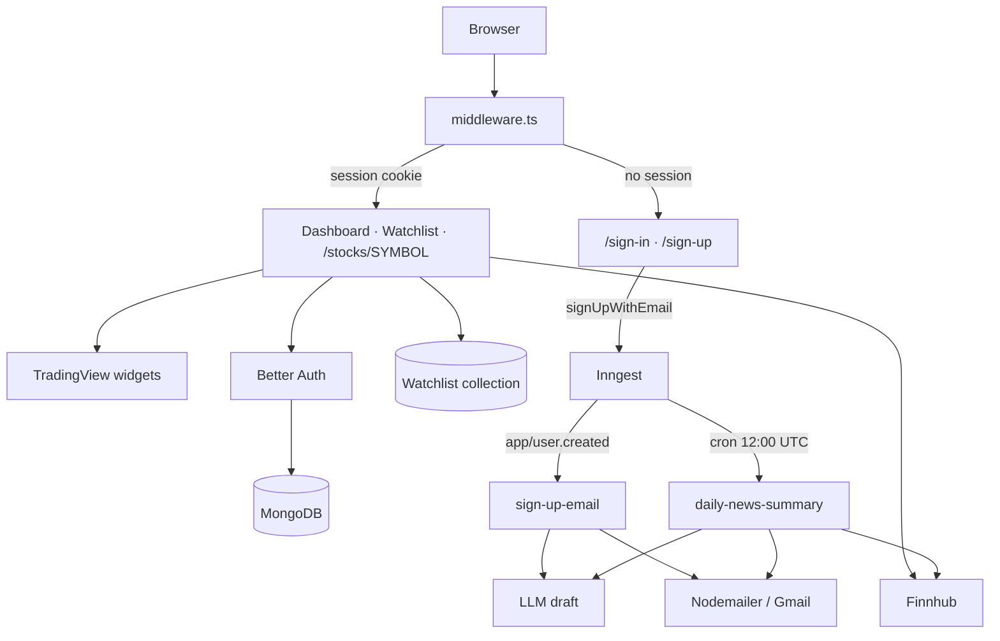

<div align="center">

# AlphaIQ

### Market terminal · Watchlists · Daily intelligence

</div>

---

## About

AlphaIQ is a personal market terminal. Sign in, read the tape on a dark dashboard of TradingView widgets, search symbols through Finnhub, open a name for a chart and wire news, and pin that name to a MongoDB watchlist. When a new account is created, an Inngest job drafts a welcome note and mails it. Every day at 12:00 UTC another job pulls watchlist news, summarizes it, and emails each user a briefing.

The product started as a Create Next App scaffold (`stocksapp` in `package.json`) and was rebuilt into AlphaIQ: auth, homepage, stock pages, search, watchlist, and the news pipeline. It is a student project, not a broker and not investment advice.

---

## What It Does

- Email/password accounts through Better Auth, stored in MongoDB
- Collects investor profile on sign-up: country, goals, risk tolerance, preferred industry
- Protects the app shell with middleware; unsigned users land on `/sign-in`
- Dashboard of dark TradingView widgets: market overview, S&P 500 heatmap, top stories, sector quotes
- Command-palette stock search against Finnhub (up to 15 hits, or a popular-name fallback)
- Symbol pages with TradingView info + advanced chart and Finnhub company news (“On the wire”)
- Per-user watchlist with live quotes, add/remove, and unique `(userId, symbol)` constraint
- Welcome email on `app/user.created`, personalized by the sign-up profile
- Daily watchlist news summary email at `0 12 * * *`, or on demand via `app/send.daily.news`

---

## Architecture



| Surface | Route | What you see |
| --- | --- | --- |
| Dashboard | `/` | “The tape, as it stands.” plus four TradingView panels |
| Symbol | `/stocks/[symbol]` | Header, watchlist button, chart, company news |
| Watchlist | `/watchlist` | Table of saved names with price, change, added date |
| Sign in | `/sign-in` | Email + password |
| Sign up | `/sign-up` | Profile form, then auto sign-in |
| Inngest webhook | `/api/inngest` | Serves `sendSignUpEmail` and `sendDailyNewsSummary` |

Search is a command palette (`SearchCommand`), not a `/search` page. `NAV_ITEMS` still lists `/search`; that route is not implemented.

---

## Tech Stack

| Layer | Choice |
| --- | --- |
| App | Next.js 15.5 (App Router) · React 19 · TypeScript |
| Style | Tailwind CSS 4 · Radix / Base UI · Lucide · Sonner |
| Auth | Better Auth · email/password · MongoDB adapter · `nextCookies` |
| Database | MongoDB via Mongoose (cached connection in `Database/mongoose.ts`) |
| Market data | Finnhub REST (`news`, `company-news`, `quote`, `search`, `profile2`) |
| Charts | TradingView embed widgets |
| Jobs | Inngest (`id: "ticker"`) |
| LLM | OpenAI-compatible inference from Inngest (`llama3.1:latest`) |
| Mail | Nodemailer through Gmail |

---

## Project Structure

```text
AlphaIQ/
├── app/
│   ├── (auth)/sign-in/page.tsx
│   ├── (auth)/sign-up/page.tsx
│   ├── (root)/page.tsx                 # dashboard
│   ├── (root)/stocks/[symbol]/page.tsx
│   ├── (root)/watchlist/page.tsx
│   ├── api/inngest/route.ts
│   ├── globals.css
│   └── layout.tsx
├── components/                         # logo, header, search, widgets, forms, UI
├── Database/
│   ├── mongoose.ts
│   └── models/watchlist.model.ts
├── lib/
│   ├── actions/                        # auth, finnhub, user, watchlist
│   ├── better-auth/auth.ts
│   ├── inngest/                        # client, functions, prompts
│   ├── nodemailer/
│   ├── Hooks/UseTradingViewWidget.tsx
│   ├── constants.ts
│   └── utils.ts
├── middleware.ts                       # session gate
├── scripts/test-db.mjs                 # npm run test:db
├── types/global.d.ts
└── package.json                        # name: "stocksapp"
```

---

## File & Module Documentation

### Auth — `lib/better-auth/auth.ts`, `lib/actions/auth.actions.ts`, `middleware.ts`

Better Auth is configured with `emailAndPassword` (min 8 / max 128 characters, auto sign-in, no email verification) and the official MongoDB adapter.

- `signUpWithEmail` creates the account, then emits `app/user.created` with the profile fields
- `signInWithEmail` signs in through `auth.api.signInEmail`
- `signOut` calls `auth.api.signOut` with request headers
- Root `middleware.ts` redirects any request without a Better Auth session cookie to `/sign-in`, except `api`, static assets, `sign-in`, `sign-up`, and `assets`

### Dashboard — `app/(root)/page.tsx`

Header copy is **Today / The tape, as it stands.** Four widgets from `lib/constants.ts`:

1. Market overview (Financial / Technology / Services tabs)
2. S&P 500 heatmap, colored by change, grouped by sector
3. Top stories timeline
4. Market quotes for the same sector baskets

Widget chrome is dark (`#141414` / `#0F0F0F`) with a teal plot color `#0FEDBE`.

### Search — `lib/actions/finnhub.actions.ts`, `components/SearchCommand.tsx`

`searchStocks(query)` hits Finnhub search and returns up to 15 matches. An empty query falls back to popular profiles via `stock/profile2`. Results feed the command palette in the header and the watchlist empty state.

### Symbol page — `app/(root)/stocks/[symbol]/page.tsx`

Resolves the ticker from the route, shows company + exchange, a `WatchlistButton`, TradingView symbol info and advanced chart, and a sidebar of Finnhub news labeled **On the wire**.

### Watchlist — `Database/models/watchlist.model.ts`, `lib/actions/watchlist.actions.ts`

Schema: `userId`, uppercase `symbol`, `company`, `addedAt`. Unique compound index on `(userId, symbol)`.

| Function | Behavior |
| --- | --- |
| `getUserWatchlist` | Items for the current session user, newest first |
| `addToWatchlist` | Upsert; revalidates `/watchlist` and `/stocks/SYMBOL` |
| `removeFromWatchlist` | Delete one row; same revalidation |
| `getWatchlistSymbolsByEmail` | Used by the daily news job |

The watchlist page joins those rows with `getQuotes` for last price and percent change.

### Jobs — `lib/inngest/functions.ts`

Welcome and news copy are drafted through Inngest’s AI helper with `llama3.1:latest`.

| Function id | Trigger | What it does |
| --- | --- | --- |
| `sign-up-email` | `app/user.created` | Drafts a two-sentence intro from country / goals / risk / industry, then `sendWelcomeEmail` |
| `daily-news-summary` | cron `0 12 * * *` or `app/send.daily.news` | Loads every user with an email, pulls watchlist news (else general news), summarizes with `NEWS_SUMMARY_EMAIL_PROMPT`, sends `sendNewsSummaryEmail` |

### Mail — `lib/nodemailer/index.ts`

Gmail transport. From-lines are `AlphaIQ` and `AlphaIQ News`.

### Database test — `scripts/test-db.mjs`

`npm run test:db` checks the Mongo connection independently of Next.

---

## Instructions to Run the Application

### Prerequisites

- Node.js 18 or newer
- MongoDB
- Finnhub access for search, quotes, and news
- Mail credentials if you want welcome / daily emails
- Inngest if you want background jobs

### Step 1 — Clone

```bash
git clone https://github.com/krishivnarainagarwal/AlphaIQ.git
cd AlphaIQ
```

### Step 2 — Install

```bash
npm install
```

### Step 3 — Database smoke test

```bash
npm run test:db
```

### Step 4 — Dev server

```bash
npm run dev
```

Open [http://localhost:3000](http://localhost:3000). You should be redirected to `/sign-in`.

For background jobs in development, also run the Inngest Dev Server against `/api/inngest`. Without it, sign-up still creates the user; the welcome email will not fire.

### Step 5 — Use the app

1. Create an account on `/sign-up`
2. Land on the dashboard widgets
3. Search a ticker from the header palette
4. Open `/stocks/AAPL` (or any symbol) and add it to the watchlist
5. Confirm it on `/watchlist` with a live quote

### Production scripts

```bash
npm run build
npm start
npm run lint
```

---

## How a Session Works

1. Middleware checks the Better Auth cookie. Missing cookie → `/sign-in`.
2. Sign-up writes the user through Better Auth, then Inngest drafts and sends the welcome mail.
3. The root layout loads the header (logo, Dashboard / Search / Watchlist, user menu).
4. Dashboard embeds TradingView; no Finnhub call is required for those four panels.
5. Search and symbol news go to Finnhub.
6. Watchlist writes are upserts on the `Watchlist` collection.
7. At 12:00 UTC, Inngest walks every user, reads their symbols, summarizes news, and mails the briefing.

---

## Manual Testing Documentation

### Valid input

- Sign-up with a real email, 8+ character password, and all profile dropdowns filled → redirect to `/`, session cookie set
- Sign-in with those credentials → dashboard
- Search `AAPL` → Apple in the palette → `/stocks/AAPL` shows chart + news
- Add to watchlist → row on `/watchlist` with price and change
- Remove from watchlist → row disappears; symbol page button returns to “add”

### Invalid / edge input

| Case | Expected behavior |
| --- | --- |
| Visit `/` while signed out | Redirect to `/sign-in` |
| Sign-up password under 8 characters | Form validation error |
| Duplicate email | Sign-up returns failure |
| Empty search query | Popular-symbol fallback list |
| Missing database connection | `connectToDatabase` throws |
| Missing market-data access | Search / quotes / news return empty or error logs |
| Inngest not running | Account still created; welcome email skipped |
| Empty watchlist | Empty state plus search CTA |
| Add the same symbol twice | Unique index; upsert, no duplicate row |

---

## Configuration Notes

| Setting | Where | Value in repo |
| --- | --- | --- |
| npm package name | `package.json` | `stocksapp` |
| Inngest app id | `lib/inngest/client.ts` | `ticker` |
| Daily news cron | `lib/inngest/functions.ts` | `0 12 * * *` (UTC) |
| Inference model | `lib/inngest/functions.ts` | `llama3.1:latest` |
| Auth password length | `lib/better-auth/auth.ts` | 8–128 |
| Watchlist uniqueness | `watchlist.model.ts` | `(userId, symbol)` |
| Finnhub search cap | `finnhub.actions.ts` | 15 results |
| Dashboard widget height | `lib/constants.ts` | 600px |

---

## Contributor

1. **Krishiv Narain Agarwal** — product, auth, dashboard, search, watchlist, mail jobs, rebrand

---

## Known Limitations

- There is no `/search` page even though the nav item points there
- `package.json` name is still `stocksapp`
- Price alerts exist as types and form constants (`ALERT_TYPE_OPTIONS`) but are not wired as a live feature
- Welcome and news copy depend on the LLM job plus mail; both are optional for browsing charts
- Finnhub free tiers rate-limit news and quotes
- Not a licensed brokerage

---

## Roadmap Ideas

- Implement `/search` or point the nav item at the command palette only
- Rename the npm package to `alphaiq`
- Ship price/volume alerts using the existing option constants
- Persist generated briefings
- Add a license file

---

<div align="center">

**AlphaIQ** · read the tape · keep a book · get the briefing

</div>
